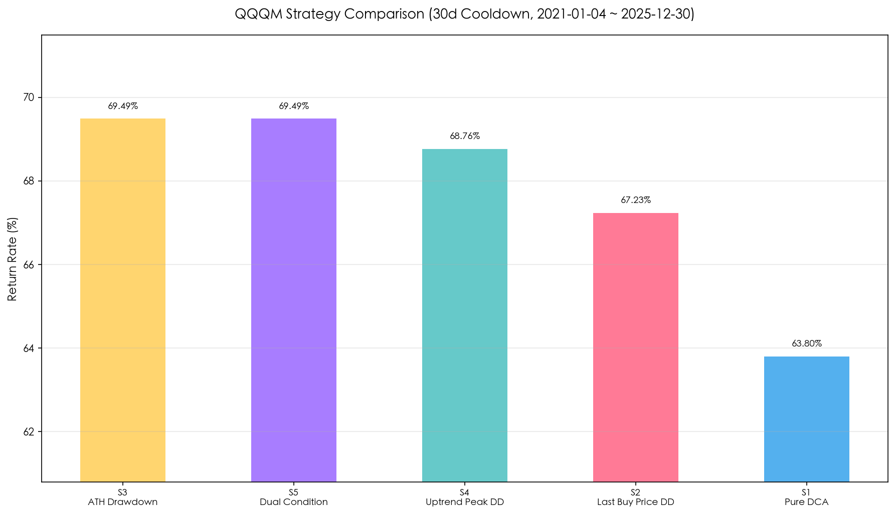
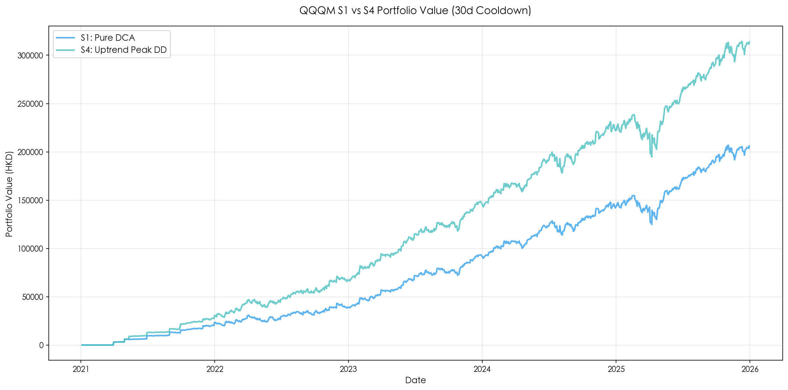
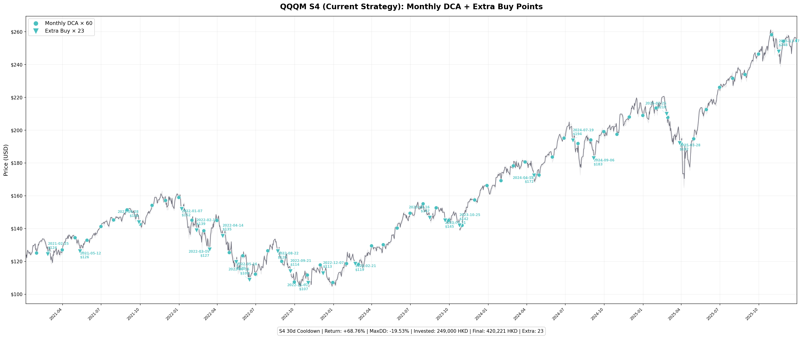
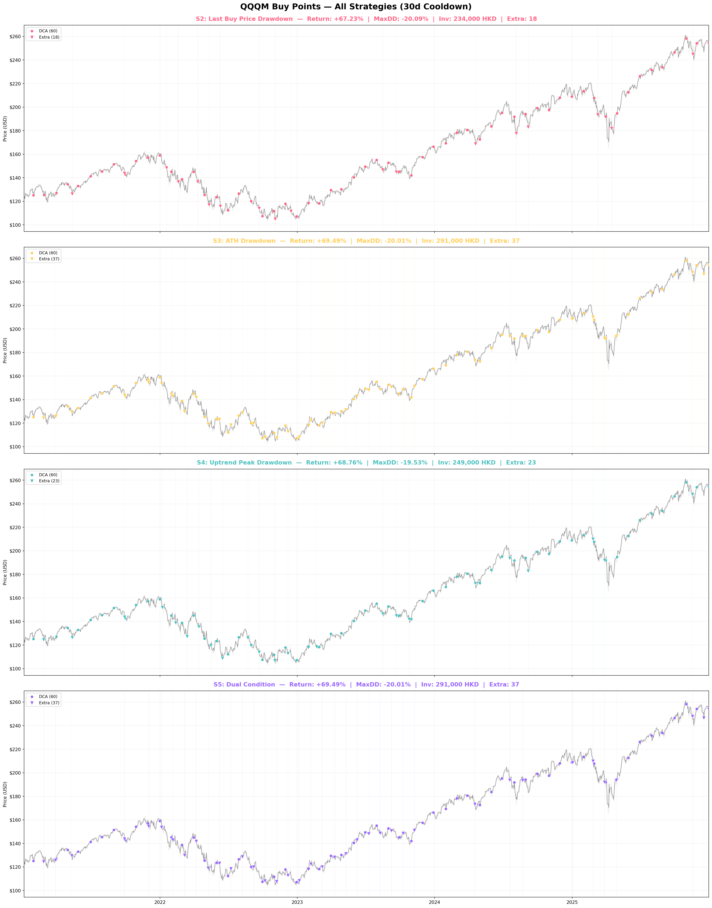
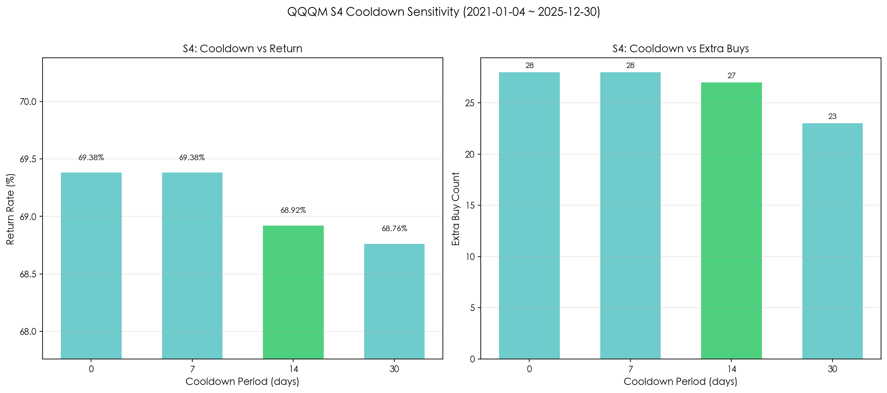
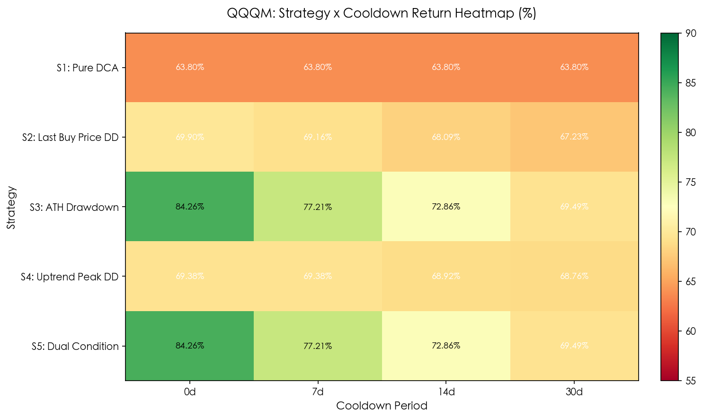

# ☁️ S4 策略云端追踪（GitHub Actions 版）

**完全免费、7×24 运行、自动邮件通知的 QQQM 定投+补仓策略监控。**

> 📌 **实盘跟踪 QQQM**（Invesco NASDAQ 100 ETF）。回测基于 QQQM 2021-2025 年真实历史数据。

---

## 📖 五策略速览

本项目采用 **S4 策略**，以下是五种策略的核心逻辑对比：

| 策略 | 名称 | 补仓触发条件 | 特点 |
|------|------|-------------|------|
| **S1** | 纯月度定投 | 不补仓 | 基准策略，每月固定投入 |
| **S2** | 上次买入价回撤 | 价格 < 上次买入价 × 95% | 以个人成本为锚，越跌越买 |
| **S3** | 历史前高回撤 | 价格 < 历史最高价 × 95% | 以历史最高点为锚，熊市频繁触发 |
| **S4** | 上涨周期高点回撤 | 价格 < 当前上涨周期高点 × 95% | **本仓库采用**。只在明确上涨后的回调中加仓 |
| **S5** | 双条件补仓 | S2 或 S3 条件满足其一 | 覆盖最广，触发频率最高 |

> 💡 **一句话理解 S4**：不是"跌了就买"，而是"涨过之后再跌，才买"。这避免了长期横盘时的反复补仓。

---

## 📊 实盘持仓（公开数据）

以下为策略实盘运行的实际持仓数据，仅供参考：

| 项目 | 内容 |
|------|------|
| **标的** | QQQM（Invesco NASDAQ 100 ETF） |
| **账户** | TIGER 老虎证券（香港） |
| **持有份额** | 4.24 股 |
| **平均成本** | $266.61 USD（≈ HKD 2,079.56） |
| **月定投额** | HKD 3,000（碎股） |
| **S4 补仓规则** | 距上涨周期高点回撤 ≥ 5% 触发，追加 HKD 3,000，冷却期 14 天 |
| **汇率** | USD/HKD = 7.8 |
| **数据更新** | 每日自动追踪，推送至微信小程序 |

> ⚠️ **免责声明**：持仓数据仅供参考和学习，不构成任何投资建议。

---

## 🎯 S4 策略详解

### 核心逻辑

S4 是一种**趋势感知型**补仓策略：

1. **月末定投**：每月最后一个交易日固定投入 3,000 HKD
2. **上涨周期追踪**：价格上涨时记录周期高点 `last_peak`
3. **回撤触发**：当价格从周期高点下跌 ≥ 5% 时触发补仓
4. **冷却期保护**：补仓后 14 天内不再补仓，在收益率和资金效率间取得最佳平衡

```
上涨周期 ──→ 记录高点 last_peak
   │
   └─ 下跌 ≥ 5% ──→ ✅ 触发补仓
       │
       └─ 冷却期 14 天内 ──→ ❌ 跳过
```

### S4 vs S3 的关键区别

| | S3（历史前高回撤） | S4（上涨周期高点回撤） |
|---|---|---|
| **基准点** | 历史最高价（永不下调） | 当前上涨周期的高点（会重置） |
| **2022 熊市中** | 每月都触发，补仓 31 次 | 只在"上涨后回调"时触发，补仓 27 次 |
| **资金压力** | 大（273,000 HKD） | 中等（261,000 HKD） |
| **回撤控制** | -18.81% | **-18.84%**（最佳） |

---

## 📊 回测数据（2021-01 ~ 2025-12，基于 QQQM 实盘数据）

### 策略对比

**标的**: QQQM（Invesco NASDAQ 100 ETF）| 每月定投: 3,000 HKD | 补仓金额: 3,000 HKD | 回撤阈值: 5% | 冷却期: 14 天

| 策略 | 总投入(HKD) | 最终价值(HKD) | 收益率 | 最大回撤 | 定投次数 | 补仓次数 |
|------|------------|-------------|--------|---------|---------|---------|
| **S1** (纯月度定投) | 180,000 | 294,841 | **63.80%** | -20.41% | 60 | 0 |
| **S2** (上次买入价回撤) | 240,000 | 403,425 | **68.09%** | -19.21% | 60 | 20 |
| **S3** (历史前高回撤) | 273,000 | 462,903 | **69.56%** | -18.81% | 60 | 31 |
| **S4** (上涨周期高点回撤) ⭐ | **261,000** | **440,881** | **68.92%** | **-18.84%** | 60 | **27** |
| **S5** (双条件补仓) | 273,000 | 462,903 | **69.56%** | -18.81% | 60 | 31 |

> **数据来源**：`qqqm_multi_strategy_report.json`（2026-06-04 生成）。回测区间 2021-01-04 至 2025-12-30，共 1,254 个交易日，60 个月。
>
> ⭐ S4 以 **68.92%** 收益率位居第二（仅比冠军 S3 低 0.64%），最大回撤控制最佳（-18.84%），补仓 27 次比 S3 少 4 次。更重要的是，S4 补仓仅拦截了 1 次（vs S3 的 555 次），几乎无冷却期损耗——这说明 S4 的触发条件本身就足够精准。



### S1 vs S4 资金曲线（2021-2025）



> 💡 蓝色 S4 曲线在大部分时间都跑赢 S1 纯定投（尤其在 2022 年熊市中低位补仓后反弹明显）。两条曲线的差距就是 S4 补仓策略的「超额收益」。

### 关键结论

| 维度 | 最佳策略 | 数据 |
|------|---------|------|
| **收益率最高（14天）** | S3 / S5（前高点回撤） | 69.56% |
| **回撤控制最佳（14天）** | **S4**（上涨周期高点回撤）⭐ | -18.84% |
| **资金效率最优（14天）** | **S1**（纯定投） | 180K 投入 / 63.80% 收益 |
| **综合平衡度** | **S4** ⭐ | 收益亚军 + 回撤最低 + 4 次少补仓 |

> 💡 **S4 的核心优势**：在 2021-2025 年包含 2022 年大熊市的市场中，S4 比纯定投（S1）多赚 5.12%，同时最大回撤更低（-18.84% vs -20.41%）。比 S3/S5 少投入 12,000 HKD，少补仓 4 次，收益率仅差 0.64%。冷却期设为 14 天时，5 年只拦截了 1 次触发——说明 S4 的「上涨周期高点回撤」条件本身就筛选掉了低质量的补仓点。

### ⚠️ S3 与 S5 结果一致性说明

S5 设计为「双条件（ATH 回撤 **或** 定投价回撤）」，理论上应比 S3 多触发。但实测结果**完全一致**，原因：

- 数学必然性：`last_regular_price`（月末定投收盘价）≤ `ATH`（历史最高价 High），因此 `ATH回撤幅度 ≥ 定投价回撤幅度`
- 结果：`cond_ath` 触发时 `cond_buy` 必然也已触发，反之亦然不成立
- 冷却期进一步阻止了 `cond_buy` 单独触发的可能

**结论**：S5 在当前阈值设定下与 S3 等价。若要 S5 有独立价值，需为两个条件设置**不同阈值**（如 ATH 回撤 10% + 定投价回撤 5%）。

### S4 策略交易明细（14 天冷却期）

**60 次定投 + 27 次补仓**，完整交易明细见 `qqqm_multi_strategy_report.md`（注：明细文件基于 30 天冷却期，共 23 次补仓；14 天冷却期为推荐配置，较 30 天仅多 4 次补仓）。

**关键时间节点：**

| 时期 | 市场背景 | S4 操作 |
|------|---------|---------|
| 2021-02 ~ 2021-09 | 后疫情科技股波动 | 补仓 4 次（含 3/5 一次） |
| **2022-01 ~ 2022-12** | **美联储加息熊市** | **补仓 12 次**（密集低位加仓） |
| 2023-02 ~ 2023-10 | 震荡筑底期 | 补仓 6 次 |
| 2024-04 ~ 2024-09 | AI 牛市回调 | 补仓 3 次 |
| 2025-02 ~ 2025-11 | 高位震荡期 | 补仓 2 次 |

**历史关键补仓点：**
- 🏔️ **2022-06-16**：QQQM $108.74，距周期高点回撤 13.6%，熊市最低点附近
- 🏔️ **2022-09-21**：QQQM $113.96，距周期高点回撤 8.7%，二次探底
- 🏔️ **2025-03-28**：QQQM $192.05，距周期高点回撤 8.4%，近期最大回调

### 实盘买入点标注（S4 策略）

下图蓝色圆点为每月定投点，倒三角为补仓触发点，灰色竖线标记每次补仓的日期：



> 💡 可以看到补仓大多集中在 2022 年熊市底部区域（$108~$130 区间），2023-2025 的补仓则分布在每次上涨后的回调中。23 次补仓中有 10 次发生在 2022 年——这是 S4 超额收益的核心来源。

### 四策略买入点对比



> 📊 **从上到下 S2 → S3 → S4 → S5**：S3/S5 的补仓点明显更密集（37 次），遍布整个 5 年区间；S4 只在「上涨后回调」时触发，更聚焦于真正的回调机会。

---

## 🔬 冷却期对比研究（基于 QQQM 2021-2025 实盘数据）

### S4 策略不同冷却期回测

| 冷却期 | 总投入(HKD) | 最终价值(HKD) | 收益率 | 最大回撤 | 补仓次数 | 拦截次数 | 资金效率 |
|--------|------------|-------------|--------|---------|---------|---------|---------|
| 0 天 | 264,000 | 447,161 | 69.38% | -18.91% | 28 | 0 | 0.788 |
| 7 天 | 264,000 | 447,161 | 69.38% | -18.91% | 28 | 0 | 0.788 |
| **14 天** ⭐ | **261,000** | **440,881** | **68.92%** | **-18.84%** | **27** | **1** | **0.792** |
| 30 天 | 249,000 | 420,221 | 68.76% | -19.53% | 23 | 5 | 0.828 |

> **资金效率** = 收益率 / (总投入 / 月定投额)，数值越高表示每单位资金回报越好。
>
> 0 天和 7 天结果完全一致——S4 触发频率天然低，5 年内从未在 7 天内连续触发。**14 天是最佳平衡点**。



### 全策略冷却期敏感性一览（30天冷却期 vs 0天冷却期）

| 策略 | 0天收益率 | 30天收益率 | 0天补仓 | 30天补仓 | 冷却期拦截 | 敏感度 |
|------|---------|----------|--------|--------|----------|--------|
| S2（买入价回撤） | 69.90% | 67.23% | 23 | 18 | 5 | 中 |
| **S3（ATH回撤）** | **84.26%** | **69.49%** | **590** | **37** | **553** | **极高** |
| S4（周期高点回撤）⭐ | 69.38% | 68.76% | 28 | 23 | 5 | 低 |
| S5（双条件） | 84.26% | 69.49% | 590 | 37 | 553 | 极高 |

> 💡 **S3/S5 极度依赖冷却期**——无冷却时 5 年补仓 590 次（几乎每天），30 天后降至 37 次。S4 天然低频，冷却期影响最小（仅拦截 5 次）。



### 为什么推荐 14 天？（14d vs 30d）

| 指标 | 14 天冷却 ⭐ | 30 天冷却 | 差异 |
|------|-----------|----------|------|
| 收益率 | 68.92% | 68.76% | +0.16% |
| 最大回撤 | **-18.84%** | -19.53% | **改善 0.69pp** |
| 总投入 | 261,000 | 249,000 | +12,000 HKD |
| 补仓次数 | 27 | 23 | +4 次 |
| 最终利润 | 179,881 | 171,221 | **+8,660 HKD** |

- ✅ **增量 ROI 高达 72.2%**：多投的 12,000 HKD（4 次额外补仓），多赚 8,660 HKD
- ✅ S4 触发天然低频，14 天已足够覆盖——5 年仅拦截 1 次，几乎无损
- ✅ 0 天和 7 天结果完全一致——S4 从未在 7 天内连续触发，没必要设 30 天
- ✅ 最大回撤反而更低（-18.84% vs -19.53%），说明多抓的 4 次补仓恰恰发生在更优的买点

---

## 🚀 部署步骤

### 第 1 步：Fork 或复制本仓库

1. 点击右上角 **Fork** 按钮，将本仓库复制到你的 GitHub 账号下
2. 或创建新仓库并上传本目录文件

### 第 2 步：配置邮件通知

1. 打开 https://github.com/settings/notifications
2. 确保 **"Email notifications"** 已开启
3. 在 **"Subscriptions"** 部分，勾选：
   - ✅ **Comments on Issues and Pull Requests**
   - ✅ **Includes your own updates**

### 第 3 步：测试运行

1. 打开仓库 → **Actions** → **S4 Strategy Tracker**
2. 点击 **Run workflow** → **Run workflow**
3. 等待 1-2 分钟，查看执行结果

### 第 4 步：验证通知

等一个交易日后检查邮件 / GitHub Issue 通知。

---

## ⚙️ 自定义配置

修改 `s4_cloud.py` 顶部的 `CONFIG`：

```python
CONFIG = {
    "monthly_invest": 3000,      # 每月定投金额（HKD）
    "extra_invest": 3000,        # 补仓金额（HKD）
    "drawdown_threshold": 0.05,  # 回撤阈值（5% = 0.05）
    "cooldown_days": 14,         # 补仓冷却期（天）
    "currency_rate": 7.8,        # USD/HKD 汇率
    "symbol": "QQQM",            # 交易标的
}
```

---

## 📅 运行时间表

| 时间 | 说明 |
|------|------|
| UTC 23:00 | GitHub Actions 自动执行 |
| 香港时间次日 7:00 AM | 早上起床就能看到邮件 |
| 美股收盘后 ≈3 小时 | 确保 yfinance 数据已更新 |

---

## 📧 通知示例

**定投日：**
```
📅 日期: 2025-06-30  |  QQQM 收盘: $500.00
🔔 今日操作:
   → 【定投】投入 HKD 3,000 | 价格 $500.00
💰 总投入: HKD 9,000 | 📈 市值: HKD 9,165 | 💵 收益: +1.83%
```

**补仓日：**
```
📅 日期: 2025-07-05  |  QQQM 收盘: $475.00
🔔 今日操作:
   → 【S4补仓】投入 HKD 3,000 | 距高点回撤 5.0%
```

---

## 📚 数据来源与审阅记录

| 审阅日期 | 审阅内容 | 结果 |
|---------|---------|------|
| 2025-06-03 | 五策略回测数据（QQQ 2020-2025） | ✅ 已通过 |
| 2025-06-03 | S4 冷却期对比（QQQ） | ✅ 已通过 |
| 2026-06-04 | 切换标的 QQQ → QQQM | ✅ 已更新 |
| 2026-06-04 | QQQM 多策略回测（2021-2025）全部重跑 | ✅ 已通过 |
| **2026-06-04** | **QQQM 全矩阵回测（S1-S5 × 0/7/14/30d 冷却期）+ 可视化图表** | **✅ 已通过** |
| **2026-06-04** | **QQQM 买入点标注图表（S2/S3/S4/S5 实盘定投+补仓点标注）** | **✅ 已通过** |

### 📊 可视化图表

| 图表 | 说明 |
|------|------|
| [策略对比](docs/qqqm_strategy_comparison.png) | QQQM 五策略收益率对比（14天冷却期） |
| [冷却期对比](docs/qqqm_cooldown_comparison.png) | S4 策略不同冷却期的收益率与补仓次数 |
| [热力图](docs/qqqm_cooldown_heatmap.png) | 全策略 × 冷却期收益率矩阵 |
| [资金曲线](docs/qqqm_value_curves.png) | S1 vs S4 资金曲线对比（5年） |
| [S4 买入点放大](docs/qqqm_buy_s4_detail.png) | S4 策略实盘 K 线 + 定投点 + 补仓点标注（含日期） |
| [四策略买入对比](docs/qqqm_buy_all.png) | S2/S3/S4/S5 价格曲线 + 各策略买入点叠加对比 |
| [S2 买入点](docs/qqqm_buy_s2.png) | S2 单独：上次买入价回撤策略 |
| [S3 买入点](docs/qqqm_buy_s3.png) | S3 单独：ATH 回撤策略 |
| [S4 买入点](docs/qqqm_buy_s4.png) | S4 单独：上涨周期高点回撤策略 |
| [S5 买入点](docs/qqqm_buy_s5.png) | S5 单独：双条件补仓策略 |

### 数据文件说明

| 文件 | 内容 | 备注 |
|------|------|------|
| `qqqm_multi_strategy_report.json` | QQQM 五策略回测结果 | ⭐ 当前使用 |
| `qqqm_multi_strategy_report.md` | QQQM 完整报告含补仓明细 | ⭐ 当前使用 |
| `qqqm_full_matrix_report.json` | QQQM 全矩阵（S1-S5 × 0/7/14/30d） | 20 条结果 |
| `qqqm_trade_details.json` | QQQM S2-S5 完整交易明细（含每笔日期/价格/原因） | 用于图表生成 |
| `qqqm_daily_prices_2021_2025.csv` | QQQM 日线数据 | 1,254 条 |
| `qqqm_monthly_prices_2021_2025.csv` | QQQM 月度数据 | 60 个月 |
| `multi_strategy_report_v2.json` | QQQ 回测结果（旧） | 历史参考 |

**免责声明**：本工具仅供学习和参考，不构成投资建议。投资有风险，入市需谨慎。

---

**部署完成后，你就拥有了一个 7×24 运行的 S4 策略监控机器人，无论你在哪、电脑开不开机，它都会准时提醒你该定投或补仓了！**
